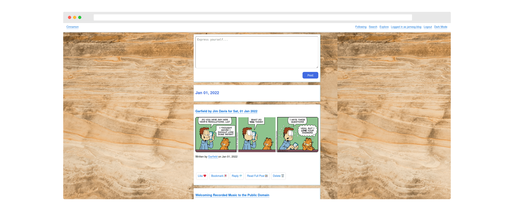

# Microsub

This repository contains the code that powers my personal Microsub client and server.

[Microsub](https://indieweb.org/Microsub) is an IndieWeb specification currently in development that separates the tasks of processing feeds and presenting feeds so that servers and feed readers can be developed independently but work together.

The Microsub server currently supports:

- Creating channels
- Updating channel names
- Changing the order of channels in a list
- Deleting channels
- Subscribing to a feed
- Unsubscribing from a feed
- Marking entries in a feed view as read

This project is in active development. The entire Micropub specification is not yet incorporated into this project.

## Screenshots

### Subscription Management (Server)

### Feed Reader (Client)

## Getting Started

To use this Microsub server for yourself, please run the following command:

    pip install -r requirements.txt

This command will install the dependencies you need to run the Microsub server.

Next, you need to set up the database for the server. You can do this using the following command:

    python3 seed.py

Now that you have set up the datasbase, you are ready to run the Microsub server.

Execute this command to run the server:

    python3 microsub.py

## Dependencies

This project relies on the following libraries:

- BeautifulSoup (bs4)
- mf2py
- feedparser
- flask-indieauth

## File Definitions

Here is the structure of this project:

- static/ - Static assets
- templates/ - HTML / Jinja2 templates for the project
- config.py - Contains configuration variables required to run the proejct
- actions.py - Contains the functions that execute actions described in the Microsub specification
- indieauth.py - Copied from [Marty McGuire's Flask IndieAuth project](https://github.com/martymcguire/Flask-IndieAuth/blob/master/flask_indieauth.py) with a small modification to support browser authentication via an IndieAuth token stored in session[]. Most credit goes to him for the code in the file.
- microsub.py - The web server code
- poll_feeds.py - Polls RSS and microformats h-feeds and retrieves data to add to a user timeline

## Muted Users Support

This endpoint does not yet provide support for muting users. This feature is partially implemented in the codebase but not yet stable.

## License

This project is licensed under the [MIT license](LICENSE).

## Maintainers

- capjamesg