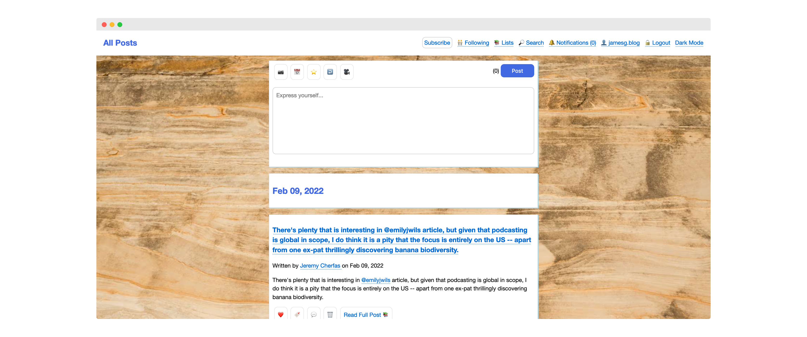
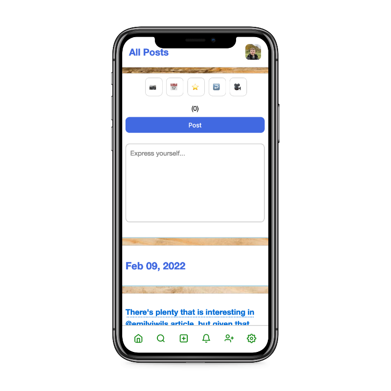

# Cinnamon Social Reader

This repository contains the code that powers my personal Microsub social reader called Cinnamon.

[Microsub](https://indieweb.org/Microsub) is an IndieWeb specification currently in development that separates the tasks of processing feeds and presenting feeds so that servers and feed readers can be developed independently but work together.

The Microsub server currently supports:

- Creating channels
- Updating channel names
- Changing the order of channels in a list
- Deleting channels
- Subscribing to a feed
- Unsubscribing from a feed
- Marking entries in a feed view as read
- Creating a post via Micropub
- Reacting to posts via Micropub
- Among other features

This project is in active development. The entire Microsub specification is not yet incorporated into this project.

## Screenshots

### Desktop

### Mobile

## Getting Started

You can install and configure this Microsub server using Docker or manually.

### Docker Setup

To set up this project with Docker, first install Docker on your local machine.

Next, run the following command:

    docker build -t microsub .

This will build the microsub image using the Dockerfile in the root directory of this project.

Next, copy the config_example.py file into the config.py file and change the values to match your server:

    cp config_example.py config.py

The Dockerfile automates the project setup process.

Next, run:

    docker run microsub

This will run the microsub server on port 5000.

### Manual Setup

To use this Microsub server for yourself, please run the following command:

    pip3 install -r requirements.txt

This command will install the dependencies you need to run the Microsub server.

Next, copy the config_example.py file into the config.py file and change the values to match your server:

    cp config_example.py config.py

Next, you need to set up the database for the server. You can do this using the following command:

    python3 seed.py

Now that you have set up the database, you are ready to run the Microsub server.

Execute this command to run the server:

    python3 wsgi.py

## File Definitions

Here is the structure of this project:

    ── Dockerfile
    ├── LICENSE.md
    ├── README.md
    ├── actions # implementations of the actions defined in the Microsub specification
    │   ├── change_to_json.py
    │   ├── channels.py
    │   ├── following.py
    │   ├── preview.py
    │   ├── react.py
    │   ├── search.py
    │   ├── timeline.py
    │   └── user_ops.py
    ├── authentication # functions to handle authentication and authorization
    │   ├── auth.py
    │   └── check_token.py
    ├── client # views used to read and manage feeds
    │   └── client_views.py
    ├── config.py # configuration file required for the project to run
    ├── feeds # code to transform three different types of feed into a jf2 object, consumed by the server
    │   ├── hfeed.py
    │   ├── json_feed.py
    │   ├── read_later.py
    │   └── xml_feed.py
    ├── legacy # old code not currently in use
    │   └── dates.py
    ├── logs
    ├── main.py # the main microsub server that responds to queries at /microsub
    ├── poll_feeds.py
    ├── requirements.txt
    ├── requirements_dev.txt
    ├── seed.py
    ├── server # code that powers feed management and the back-end server
    │   ├── server_views.py
    │   └── websub.py
    ├── static # all static files used in the project
    │   ├── css
    │   │   └── styles.css
    │   ├── emojis.json
    │   ├── favicon.ico
    │   ├── icons
    │   ├── images
    │   │   └── wood.avif
    │   ├── js
    │   │   ├── editor.js # js to load the post editor form
    │   │   └── reader.js # js to enhance reading capabilities, including reactions
    │   ├── manifest.json
    │   └── robots.txt
    ├── templates # all the HTML templates for the project
    │   ├── 404.html
    │   ├── auth.html
    │   ├── base.html
    │   ├── client # HTML used by the client
    │   │   ├── discover.html
    │   │   ├── feed_item.html
    │   │   ├── preview.html
    │   │   ├── read_article.html
    │   │   ├── reader.html
    │   │   ├── search.html
    │   │   └── settings.html
    │   ├── index.html
    │   ├── server # HTML used by the server management client
    │   │   ├── dashboard.html
    │   │   └── following.html
    │   ├── setup.html
    │   └── show_error.html
    ├── tox.ini
    └── wsgi.py

This tree was generated using the following command:

    tree -I '*.pyc|*.png|*.svg|*.log|__*'

## License

This project is licensed under an [MIT 0 license](LICENSE).

## Acknowledgements

The author of this project would like to thank the [Feather](https://github.com/feathericons/feather) open source icon set for creating an open repository of icons. This project uses a few icons from Feather in the mobile view.

This project uses the "[Complete list of github markdown emoji markup](https://gist.github.com/rxaviers/7360908)" Gist for its emoji autocomplete dictionary.

## Maintainers

- [capjamesg](https://github.com/capjamesg)